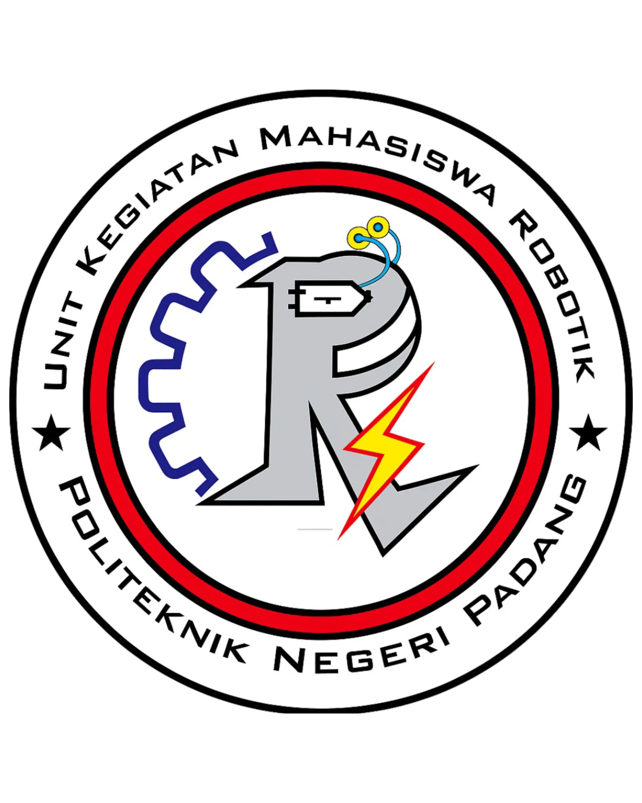

# Sistem Informasi Manajemen UKM Robotik Politeknik Negeri Padang

<p align="center">
  
</p>

<p align="center">
  <b>Platform SaaS Terpadu untuk Manajemen Organisasi, Open Recruitment, Kegiatan, Presensi Digital, Kedisiplinan, dan Piket Workshop</b>
  <br />
  <i>Pengembang & Hak Cipta: UKM Robotik Politeknik Negeri Padang (PNP)</i>
</p>

---

> ℹ️ **Catatan Repositori Publik:**  
> Repositori ini dipublikasikan secara terbuka di GitHub sebagai bentuk transparansi, referensi teknis, dan portofolio pengembangan perangkat lunak. Sistem ini dirancang dan disesuaikan secara khusus (_custom-built_) untuk memenuhi tata kelola operasional dan proses bisnis **UKM Robotik Politeknik Negeri Padang**.

---

## 📌 Fitur Utama Sistem

Sistem ini mendukung pengelolaan operasional berbasis **Role-Based Access Control (RBAC)** dengan 7 peranan pengguna:

1. **Authentication & Identity Mapping**
   - Autentikasi aman berbasis Supabase Auth SSR (`@supabase/ssr`).
   - Penyelarasan ID unik otomatis antara tabel registrasi dan profil pengguna.

2. **Open Recruitment (Oprec) & Manajemen Calon Anggota (Caang)**
   - Konfigurasi jendela waktu pendaftaran open recruitment oleh `admin-or`.
   - Pembagian kelompok calon anggota dan penugasan mentor anggota aktif.
   - Sistem **Scan QR Code Absensi Oprec** untuk verifikasi presensi instan.

3. **Kegiatan & Presensi Digital**
   - Agenda kegiatan pelatihan, workshop teknologi robotik, dan rapat internal.
   - Log presensi digital secara real-time dengan verifikasi tanda tangan atau QR code.
   - Mode kustomisasi presensi untuk Anggota Aktif dan Calon Anggota.

4. **Kedisiplinan & Perizinan (Komisi Kedisiplinan / Admin Komdis)**
   - Alur pengajuan surat izin (sakit, berhalangan, tugas kampus) berbasis verifikasi admin.
   - Pemantauan poin kedisiplinan, catatan rekap kehadiran, dan evaluasi Calon Anggota oleh Komite Kedisiplinan (`admin-komdis`).

5. **Manajemen Piket Kesekretariatan & Workshop (Admin Kestari)**
   - Penjadwalan otomatis piket kebersihan & perawatan inventaris kesekretariatan dan workshop.
   - Pengawasan, rotasi shift, dan rekapan kehadiran piket diselenggarkan oleh `admin-kestari`.

6. **Magang Divisi Caang (Admin Divisi)**
   - Pengelolaan magang divisi spesifik (Programming/Elektronika/Mekanik) bagi Calon Anggota.
   - Penugasan proyek divisi, monitoring progres, dan evaluasi magang divisi oleh `admin-divisi`.

7. **Manajemen Akun & Struktur Organisasi**
   - Pengelolaan akun pengguna, pembaruan peranan (Role), dan pengaturan hirarki struktur kepengurusan.

8. **Audit Log & Traceability**
   - Pencatatan transaksi mutasi data (_INSERT_, _UPDATE_, _DELETE_) secara otomatis dan _non-nullable_ ke dalam sistem audit log untuk transparansi dan akuntabilitas.

---

## 🔐 Matriks Hak Akses (Role-Based Access Control)

| Hak Akses / Role                                           | Deskripsi & Cakupan Modul                                                                                                       |
| :--------------------------------------------------------- | :------------------------------------------------------------------------------------------------------------------------------ |
| **`super-admin`**                                          | Akses penuh ke seluruh modul sistem, manajemen akun pengguna, pengaturan struktur, dan audit log sistem.                        |
| **`admin-or`** _(Admin Organisasi)_                        | Pengelolaan Open Recruitment (Oprec), Manajemen Caang, Kelompok Caang, Kegiatan & Presensi Caang.                               |
| **`admin-komdis`** _(Admin Komdis)_                        | Pengelolaan Kedisiplinan, Surat Perizinan, Poin Pelanggaran, Rekap Kehadiran, dan Evaluasi Kedisiplinan Caang.                  |
| **`admin-kestari`** _(Admin Kesekretariatan & Inventaris)_ | Pengelolaan dan pembuatan jadwal piket kesekretariatan & piket workshop.                                                        |
| **`admin-divisi`** _(Admin Divisi)_                        | Pengelolaan magang divisi caang, penugasan proyek divisi robotik, pembimbingan divisi, dan evaluasi magang divisi.              |
| **`anggota`** _(Anggota Aktif)_                            | Akses jadwal kegiatan UKM, presensi kegiatan, piket anggota, dan pendampingan magang.                                           |
| **`caang`** _(Calon Anggota)_                              | Akses alur pendaftaran Oprec, detail kelompok, magang divisi, jadwal piket kesekretariatan & workshop, serta pengumpulan tugas. |

---

## 🛠️ Stack Teknologi

Aplikasi dibangun menggunakan stack teknologi modern dengan performa tinggi dan proteksi ketat:

- **Core Framework**: [Next.js 16](https://nextjs.org/) (App Router & React Server Components)
- **Frontend Library**: [React 19](https://react.dev/) (Actions, `useTransition`, `useActionState`)
- **Bahasa**: [TypeScript 5](https://www.typescriptlang.org/) dengan konfigurasi ketat (`strict: true`)
- **Backend & Database**: [Supabase Cloud](https://supabase.com/) (PostgreSQL 15/16, Supabase Auth SSR, Storage Bucket, RLS Security)
- **Caching & Rate Limiting**: [Upstash Redis](https://upstash.com/) (`@upstash/redis`, `@upstash/ratelimit`)
- **UI & Styling**: [Tailwind CSS v4](https://tailwindcss.com/), [Shadcn UI](https://ui.shadcn.com/), Lucide Icons & Hugeicons, Framer Motion
- **Form & Validasi**: [Zod](https://zod.dev/) untuk validasi skema data inbound di Server Actions
- **Testing & Quality**: [Vitest](https://vitest.dev/) (Unit Testing), [Playwright](https://playwright.dev/) (End-to-End Testing), [Sentry](https://sentry.io/) (Application Monitoring)
- **Security & Bot Protection**: Cloudflare WAF, Turnstile CAPTCHA (`@marsidev/react-turnstile`)

---

## 🚀 Cara Menjalankan Proyek (Local Development)

### 1. Prasyarat Sistem

- **Node.js** v20.x atau lebih baru
- **pnpm** (direkomendasikan) atau `npm` / `yarn`
- **Git**

### 2. Kloning Repositori & Instal Dependensi

```bash
git clone https://github.com/username/robotik-pnp.git
cd robotik-pnp
pnpm install
```

### 3. Konfigurasi Environment Variables

Buat file `.env.local` di root proyek dan isikan variabel berikut (sesuaikan dengan kredensial Supabase & layanan Anda):

```env
# Site URL
NEXT_PUBLIC_SITE_URL=http://localhost:3000

# Supabase Credentials
NEXT_PUBLIC_SUPABASE_URL=https://your-project.supabase.co
NEXT_PUBLIC_SUPABASE_ANON_KEY=your-anon-key
SUPABASE_SERVICE_ROLE_KEY=your-service-role-key

# Turnstile Security (CAPTCHA)
NEXT_PUBLIC_TURNSTILE_SITE_KEY=your-turnstile-site-key
TURNSTILE_SECRET=your-turnstile-secret-key

# Upstash Redis (Caching & Rate Limit)
UPSTASH_REDIS_REST_URL=https://your-redis.upstash.io
UPSTASH_REDIS_REST_TOKEN=your-upstash-token

# Sentry & Cloudflare Storage (Optional for Dev)
NEXT_PUBLIC_SENTRY_DSN=your-sentry-dsn
CLOUDFLARE_R2_ACCESS_KEY_ID=your-r2-access-key
CLOUDFLARE_R2_SECRET_ACCESS_KEY=your-r2-secret-key
CLOUDFLARE_R2_BUCKET_NAME=ukm-robotik-pnp
```

### 4. Menjalankan Server Pengembang

```bash
pnpm dev
```

Buka browser di `http://localhost:3000` untuk melihat aplikasi.

### 5. Menjalankan Type Checking & Testing

```bash
# Typecheck TypeScript
pnpm typecheck

# Jalankan Unit Test (Vitest)
pnpm test

# Jalankan Dashboard UI Vitest
pnpm test:ui
```

---

## 📁 Struktur Repositori

```
robotik-pnp/
├── app/                        # Next.js App Router (Pages, Layouts & Route Handlers)
│   ├── (auth)/                 # Halaman Autentikasi (Login, Register, Reset Password)
│   ├── (marketing)/            # Halaman Landing Page / Portal Publik UKM
│   ├── (onboarding-flow)/      # Halaman Melengkapi Profil Awal Pengguna
│   └── (private)/              # Dashboard & Modul Terproteksi RBAC (Kegiatan, Presensi, Piket, dll)
├── components/                 # Komponen UI Reusable
│   ├── features/               # Komponen UI Spesifik Fitur (Kegiatan, Oprec, Piket, Komdis)
│   ├── shared/                 # Komponen Layout Shared (Sidebar, Header, Loaders)
│   └── ui/                     # Komponen Base Primitives (Shadcn UI)
├── docs/                       # Pusat Dokumentasi Arsitektur Sistem (IEEE 42010 / ISO 27001)
├── hooks/                      # Custom React Hooks
├── lib/                        # Utility & Konfigurasi Backend
│   ├── actions/                # Next.js Server Actions (Business Logic & Mutations)
│   └── supabase/               # Client Factories Supabase (Server, Browser, Middleware)
├── public/                     # Asset Statis (Gambar, Logo, Icon)
├── supabase/                   # Supabase Migrations, Config & Schema Sql
└── types/                      # TypeScript Definitions & Database Types
```

---

## 📖 Pusat Dokumentasi Terpadu

Arsitektur detail, standar keamanan ISO 27001, diagram proses bisnis BPMN 2.0, topologi deployment, dan pedoman kualitas dapat diakses secara lengkap pada folder **`docs/`**:

- 📘 [Induk Arsitektur Sistem & Master Index](docs/README.md)
- 🔄 [Dokumentasi Alur Kerja & Process View](docs/04-process-view/workflow-documentation.md)
- 🏗️ [Arsitektur Fisik & Deployment Topology](docs/05-physical-view/README.md)
- 🛡️ [Tata Kelola ISMS & Kepatuhan Keamanan Data](docs/07-compliance-security/README.md)
- 💻 [Standar Rekayasa & Referensi Teknis](docs/08-tech-references/README.md)

---

## 📄 Lisensi & Hak Cipta

© 2026 **UKM Robotik Politeknik Negeri Padang**. All Rights Reserved.  
Dikembangkan untuk mendukung tata kelola digital dan keberlanjutan kegiatan robotika di **Politeknik Negeri Padang**.
