# Dokumentasi Database Architecture & Schema

Dokumen ini dirancang sebagai panduan komprehensif struktur basis data (Database Schema) Supabase / PostgreSQL untuk membantu **AI Agent** dan pengembang dalam memahami, membuat query, serta mengelola data aplikasi tanpa perlu mencari informasi dari tempat lain.

<!-- NOTE UNTUK PEMELIHARA DATABASE:
Jika ada catatan arsitektur, batasan khusus, atau instruksi lingkungan lokal/production yang ingin ditambahkan secara manual, silakan tambahkan pada bagian komentar di bawah ini atau buat seksi baru di dokumen ini.
-->

---

## 1. Overview & General Principles

- **Database Engine**: PostgreSQL 15+ (Supabase)
- **Primary Auth Provider**: Supabase Auth (`auth.users`)
- **Primary Schema**: `public`
- **Security Standard**: Row Level Security (RLS) diaktifkan pada semua tabel publik.
- **Type Definitions**: `types/database.types.ts`
- **Migration Location**: `supabase/migrations/`

---

## 2. Global Enums

| Enum Name | Enum Values | Deskripsi |
| :--- | :--- | :--- |
| `user_role` | `super-admin`, `admin-or`, `admin-komdis`, `admin-kestari`, `admin-divisi`, `anggota`, `caang`, `alumni` | Peran pengguna dalam hierarki sistem & otorisasi RLS |
| `activity_target` | `caang`, `anggota` | Target peserta untuk kegiatan/presensi |
| `attendance_status` | `hadir`, `izin`, `sakit`, `alfa`, `telat`, `magang` | Status presensi anggota/caang |
| `gender_type` | `L`, `P` | Jenis kelamin (Laki-laki / Perempuan) |
| `piket_day` | `Senin`, `Selasa`, `Rabu`, `Kamis`, `Jumat`, `Sabtu`, `Minggu` | Hari penugasan piket |
| `reg_status` | `process`, `pending`, `verified`, `rejected`, `revision` | Status pendaftaran Calon Anggota (Caang) |
| `task_status` | `belum_selesai`, `diperiksa`, `selesai`, `revisi` | Status pengumpulan tugas caang |

---

## 3. Entity Relationship Diagram (ERD)

```mermaid
erDiagram
    auth_users ||--o| profiles : "1:1 via id"
    profiles ||--o| registrations : "1:1 via profile_id"
    profiles ||--o| legacy_members : "1:1 via profile_id"
    majors ||--o{ study_programs : "1:N"
    study_programs ||--o{ registrations : "1:N"
    study_programs ||--o{ legacy_members : "1:N"
    departments ||--o{ organizational_histories : "1:N"
    divisions ||--o{ organizational_histories : "1:N"
    membership_periods ||--o{ organizational_histories : "1:N"
    legacy_members ||--o{ organizational_histories : "1:N via nim_member"

    profiles ||--o{ caang_groups : "mentor"
    caang_groups ||--o{ group_members : "1:N"
    profiles ||--o| group_members : "1:1"
    divisions ||--o{ internships : "1:N"
    profiles ||--o| internships : "1:1"

    profiles ||--o{ tasks : "created_by"
    tasks ||--o{ task_submissions : "1:N"
    profiles ||--o{ task_submissions : "submitted_by"

    profiles ||--o{ activities : "created_by"
    activities ||--o{ attendances : "1:N"
    profiles ||--o{ attendances : "profile_id"

    profiles ||--o{ discipline_point_logs : "profile_id"
    profiles ||--o{ sanctions : "profile_id"

    piket_schedules ||--o{ piket_members : "1:N"
    profiles ||--o{ piket_members : "1:N"
    piket_schedules ||--o{ piket_logs : "1:N"
    piket_schedules ||--o{ piket_fines : "1:N"
    profiles ||--o{ piket_fines : "profile_id"

    event_categories ||--o{ event_registrations : "1:N"
    event_rules_versions ||--o{ event_registrations : "1:N"
    event_registrations ||--o{ event_team_members : "1:N"
    event_team_members ||--o{ event_member_verifications : "1:N"
    event_registrations ||--o{ event_violations : "1:N"

    review_registrations ||--o{ review_transactions : "1:N"
```

---

## 4. Feature Modules & Table Specifications

### Module 1: User, Auth & Core System

#### 1. `profiles`
Tabel utama profil pengguna yang terhubung 1-to-1 dengan Supabase Auth (`auth.users`).

- **Columns**:
  - `id` (`uuid`, Primary Key, Foreign Key -> `auth.users.id` ON DELETE CASCADE)
  - `email` (`text`, NOT NULL, UNIQUE)
  - `full_name` (`text`, NULLABLE)
  - `nim` (`text`, NULLABLE, UNIQUE)
  - `avatar_url` (`text`, NULLABLE)
  - `role` (`user_role`, DEFAULT `'caang'`, NOT NULL)
  - `role_event` (`text`, NULLABLE)
  - `is_onboarded` (`boolean`, DEFAULT `false`, NOT NULL)
  - `is_on_internship` (`boolean`, DEFAULT `false`, NOT NULL)
  - `internship_start_date` (`date`, NULLABLE)
  - `internship_end_date` (`date`, NULLABLE)
  - `delete_reason` (`text`, NULLABLE)
  - `deleted_at` (`timestamptz`, NULLABLE - Soft delete support)
  - `created_at` (`timestamptz`, DEFAULT `now()`, NOT NULL)
  - `updated_at` (`timestamptz`, DEFAULT `now()`, NOT NULL)

- **Foreign Keys**:
  - `id` -> `auth.users(id)`

- **Indexes**:
  - `profiles_pkey` (PRIMARY KEY, `id`)
  - `profiles_email_key` (UNIQUE, `email`)
  - `profiles_nim_key` (UNIQUE, `nim`)
  - `idx_profiles_role` (`role`)
  - `idx_profiles_deleted_at` (`deleted_at`)

- **Triggers**:
  - `handle_updated_at`: Mengubah `updated_at` ke `now()` sebelum UPDATE.
  - `protect_profile_role_update`: Mencegah pengguna non-superadmin mengubah kolom `role`.

- **RLS Policies**:
  - SELECT: Pengguna terautentikasi dapat melihat profil aktif (atau admin dapat melihat semua).
  - UPDATE: Pengguna dapat mengupdate profil milik sendiri (kecuali role).
  - INSERT / DELETE: Dibatasi untuk sistem / super-admin.

---

#### 2. `system_audit_logs`
Catatan jejak audit aktivitas sistem untuk keamanan dan pemantauan perubahan data.

- **Columns**:
  - `id` (`uuid`, Primary Key, DEFAULT `gen_random_uuid()`)
  - `actor_id` (`uuid`, Foreign Key -> `profiles.id`, NULLABLE)
  - `action_type` (`text`, NOT NULL)
  - `target_user_id` (`uuid`, NULLABLE)
  - `old_value` (`jsonb`, NULLABLE)
  - `new_value` (`jsonb`, NULLABLE)
  - `details` (`text`, NULLABLE)
  - `ip_address` (`text`, NULLABLE)
  - `created_at` (`timestamptz`, DEFAULT `now()`, NOT NULL)

- **Triggers**:
  - Immutability trigger: Mencegah UPDATE dan DELETE pada log audit.

- **RLS Policies**:
  - SELECT: Khusus role `super-admin` dan `admin-komdis`.
  - INSERT: Pengguna terautentikasi / trigger sistem.

---

#### 3. `in_app_notifications`
Notifikasi dalam aplikasi untuk pengguna.

- **Columns**:
  - `id` (`uuid`, Primary Key, DEFAULT `gen_random_uuid()`)
  - `recipient_id` (`uuid`, Foreign Key -> `profiles.id`, NOT NULL)
  - `title` (`text`, NOT NULL)
  - `message` (`text`, NOT NULL)
  - `type` (`text`, DEFAULT `'info'`, NOT NULL)
  - `is_read` (`boolean`, DEFAULT `false`, NOT NULL)
  - `reference_type` (`text`, NULLABLE)
  - `reference_id` (`uuid`, NULLABLE)
  - `created_at` (`timestamptz`, DEFAULT `now()`, NOT NULL)

- **RLS Policies**:
  - SELECT & UPDATE: `recipient_id = auth.uid()`

---

### Module 2: Academic & Organizational Structure

#### 1. `majors` (Jurusan)
- **Columns**: `id` (`uuid`, PK), `name` (`text`, UNIQUE), `created_at` (`timestamptz`).
- **RLS**: Public read-only.

#### 2. `study_programs` (Program Studi)
- **Columns**: `id` (`uuid`, PK), `major_id` (`uuid`, FK -> `majors.id`), `name` (`text`), `degree` (`text`), `created_at` (`timestamptz`).
- **RLS**: Public read-only.

#### 3. `departments` (Departemen)
- **Columns**: `id` (`uuid`, PK), `name` (`text`), `category` (`text`), `sort_order` (`int4`), `created_at` (`timestamptz`).
- **RLS**: Public read-only.

#### 4. `divisions` (Divisi)
- **Columns**: `id` (`uuid`, PK), `name` (`text`), `slug` (`text`, UNIQUE), `short_description` (`text`), `description` (`text`), `badge_color` (`text`), `badge_label` (`text`), `accent_color` (`text`), `tags` (`jsonb`), `sort_order` (`int4`), `is_active` (`boolean`), `created_at` (`timestamptz`).
- **RLS**: Public read-only.

#### 5. `membership_periods` (Periode Kepengurusan)
- **Columns**: `id` (`uuid`, PK), `period_name` (`text`), `is_active` (`boolean`), `created_at`, `updated_at`.
- **RLS**: Public read-only.

#### 6. `legacy_members` (Anggota Lama / Data Alumni & Anggota Aktif)
- **Columns**:
  - `nim` (`text`, Primary Key)
  - `full_name` (`text`, NOT NULL)
  - `gender` (`text`, NULLABLE)
  - `study_program_id` (`uuid`, FK -> `study_programs.id`)
  - `avatar_url` (`text`, NULLABLE)
  - `slug` (`text`, UNIQUE)
  - `profile_id` (`uuid`, FK -> `profiles.id`, UNIQUE, NULLABLE)
  - `created_at` (`timestamptz`)

#### 7. `organizational_histories` (Riwayat Organisasi)
- **Columns**: `id` (`uuid`, PK), `nim_member` (`text`, FK -> `legacy_members.nim`), `period_id` (`uuid`, FK -> `membership_periods.id`), `department_id` (`uuid`, FK -> `departments.id`), `division_id` (`uuid`, FK -> `divisions.id`), `role_name` (`text`), `sub_section` (`text`), `sort_order` (`int4`), `created_at`, `updated_at`.

---

### Module 3: Open Recruitment (OR) & Caang Management

#### 1. `or_settings`
Pengaturan pendaftaran Open Recruitment.
- **Columns**: `id` (`uuid`, PK), `status_pendaftaran` (`boolean`), `periode_recruitment` (`text`), `biaya_pendaftaran` (`numeric`), `tanggal_mulai` (`timestamptz`), `tanggal_selesai` (`timestamptz`), `rekening_penerima` (`jsonb`), `kontak_panitia` (`jsonb`), `link_komunitas` (`jsonb`), `timeline` (`jsonb`), `created_at`, `updated_at`.
- **RLS**: Public read / Admin OR full access.

#### 2. `registrations`
Data pendaftaran Calon Anggota (Caang).
- **Columns**: `id` (`uuid`, PK), `profile_id` (`uuid`, FK -> `profiles.id`, UNIQUE), `full_name` (`text`), `nickname` (`text`), `gender` (`gender_type`), `pob` (`text`), `dob` (`date`), `phone_number` (`text`), `domicile_address` (`text`), `origin_address` (`text`), `high_school` (`text`), `study_program_id` (`uuid`, FK -> `study_programs.id`), `entry_year` (`int4`), `current_class` (`text`), `motivation` (`text`), `org_experience` (`text`), `achievements` (`text`), `photo_url` (`text`), `ktm_url` (`text`), `proof_follow_robotik` (`text`), `proof_follow_mrc` (`text`), `proof_sub_yt` (`text`), `payment_proof_url` (`text`), `payment_method` (`text`), `status` (`reg_status`, DEFAULT `'process'`), `revision_notes` (`text`), `delete_reason` (`text`), `deleted_at` (`timestamptz`), `created_at`, `updated_at`.
- **RLS**: Owner (`profile_id = auth.uid()`) can READ/UPDATE; Admin OR / Admin Komdis full management.

#### 3. `caang_groups` & `group_members`
Kelompok pendampingan Caang dan pembagian mentor.
- **`caang_groups`**: `id`, `name`, `mentor_id` (FK -> `profiles.id`), `parent_id` (FK -> `caang_groups.id`), `created_at`.
- **`group_members`**: `id`, `group_id` (FK -> `caang_groups.id`), `profile_id` (FK -> `profiles.id`, UNIQUE).

#### 4. `internships`
Status magang divisi untuk Caang.
- **Columns**: `id`, `profile_id` (FK -> `profiles.id`, UNIQUE), `division_id` (FK -> `divisions.id`), `mentor_id` (FK -> `profiles.id`), `task_description`, `created_at`.

#### 5. `tasks` & `task_submissions`
Penugasan Caang dan pengumpulan tugas.
- **`tasks`**: `id`, `title`, `description`, `due_date`, `created_by` (FK -> `profiles.id`), `created_at`.
- **`task_submissions`**: `id`, `task_id` (FK -> `tasks.id`), `profile_id` (FK -> `profiles.id`), `submission_url`, `notes`, `status` (`task_status`), `grade` (`int4`), `feedback`, `graded_by` (FK -> `profiles.id`), `created_at`, `updated_at`.

---

### Module 4: Activities, Attendance & Discipline

#### 1. `activities` (Kegiatan)
- **Columns**: `id`, `title`, `description`, `location`, `start_date`, `end_date`, `checkin_open_at`, `checkin_close_at`, `late_tolerance_minutes` (`int4`, DEFAULT 15), `target_audience` (`activity_target`), `banner_url`, `created_by` (FK -> `profiles.id`), `deleted_at`, `created_at`, `updated_at`.

#### 2. `attendances` (Presensi & Absence)
- **Columns**: `id`, `activity_id` (FK -> `activities.id`), `profile_id` (FK -> `profiles.id`), `status` (`attendance_status`), `check_in_at`, `proof_url`, `notes`, `points_awarded` (`int4`), `approval_status`, `rejection_reason`, `verified_by` (FK -> `profiles.id`), `verified_at`, `created_at`.

#### 3. `discipline_point_logs`
Catatan poin pelanggaran/kedisiplinan.
- **Columns**: `id`, `profile_id` (FK -> `profiles.id`), `points` (`int4`), `category` (`text`), `description` (`text`), `created_by` (FK -> `profiles.id`), `created_at`.

#### 4. `sanctions`
Surat Peringatan (SP) / Sanksi Kedisiplinan.
- **Columns**: `id`, `profile_id` (FK -> `profiles.id`), `sp_level` (`int4`), `points_at_issuance` (`int4`), `status` (`text`), `notes` (`text`), `issued_by` (FK -> `profiles.id`), `issued_at`.

#### 5. `v_user_discipline_summary` (VIEW)
View rekapitulasi poin kedisiplinan pengguna (mengagregasikan poin presensi, poin goro, poin legacy, dan poin log).

---

### Module 5: Piket & Kebersihan

#### 1. `piket_schedules`
Jadwal piket rutin berdasarkan periode akademik, minggu, dan hari.
- **Columns**: `id`, `academic_period` (`text`), `week_number` (`int4`), `day` (`piket_day`), `room_target` (`text`), `created_at`.

#### 2. `piket_members`
Anggota yang bertugas pada jadwal piket tertentu.
- **Columns**: `id`, `schedule_id` (FK -> `piket_schedules.id`), `profile_id` (FK -> `profiles.id`).

#### 3. `piket_logs`
Laporan hasil pelaksanaan piket (foto sebelum, foto sesudah, verifikasi kestari).
- **Columns**: `id`, `schedule_id` (FK -> `piket_schedules.id`), `duty_date` (`date`), `reported_by` (FK -> `profiles.id`), `proof_image_before_url`, `proof_image_url` (foto sesudah), `photo_taken_at_before`, `photo_taken_at_after`, `photo_hash_before`, `photo_hash_after`, `notes`, `is_verified`, `rejection_reason`, `verified_by` (FK -> `profiles.id`), `verified_at`, `is_final`, `finalized_at`, `created_at`.

#### 4. `piket_fines`
Denda ketidakhadiran / kelalaian piket.
- **Columns**: `id`, `schedule_id` (FK -> `piket_schedules.id`), `profile_id` (FK -> `profiles.id`), `amount` (`numeric`), `status` (`text`, DEFAULT `'unpaid'`), `paid_at`, `imposed_by` (FK -> `profiles.id`), `notes`, `created_at`.

---

### Module 6: Event & Competition Registration System

#### 1. `event_categories`
Kategori lomba / event (misal: Robotik SD, SMP, SMA, Umum).
- **Columns**: `id`, `name`, `slug`, `description`, `registration_fee` (`numeric`), `registration_fee_batch1` (`numeric`), `registration_fee_batch2` (`numeric`), `quota` (`int4`), `max_team_members` (`int4`), `whatsapp_group_url`, `is_active`, `created_at`, `updated_at`.

#### 2. `event_settings`
Pengaturan jadwal batch, timeline, dan nomor rekening pembayaran event.
- **Columns**: `id` (`int4`, PK = 1), `batch1_start`, `batch1_end`, `batch2_start`, `batch2_end`, `event_start`, `event_end`, `timeline_release_date`, `technical_meeting_start`, `technical_meeting_end`, `payment_mode` (`text`, DEFAULT `'both'`), `bank_name`, `bank_account_number`, `bank_account_holder`, `bank_accounts` (`jsonb`), `created_at`, `updated_at`.

#### 3. `event_rules_versions`
Versi rulebook / aturan lomba.
- **Columns**: `id`, `category_id` (FK -> `event_categories.id`), `version`, `content`, `published_at`.

#### 4. `event_registrations`
Pendaftaran tim peserta event.
- **Columns**: `id`, `registration_code` (`text`, UNIQUE), `access_token` (`text`), `category_id` (FK -> `event_categories.id`), `team_name` (`text`), `institution` (`text`), `origin_city` (`text`), `advisor_name` (`text`), `team_email` (`text`), `team_whatsapp` (`text`), `registration_batch` (`text`), `total_amount` (`numeric`), `payment_status` (`text`, DEFAULT `'pending'`), `payment_bank_name`, `payment_bank_account_number`, `payment_bank_account_holder`, `manual_payment_proof_url`, `paid_at`, `rejection_reason`, `rules_version_id` (FK -> `event_rules_versions.id`), `rules_accepted_at`, `midtrans_order_id`, `midtrans_snap_token`, `midtrans_payment_type`, `midtrans_qr_url`, `midtrans_qr_expiry`, `created_at`, `updated_at`.

- **Indexes**:
  - `idx_event_registrations_code` (`registration_code`)
  - `idx_event_registrations_category_payment` (`category_id`, `payment_status`)
  - `idx_event_registrations_access_token` (`access_token`)

#### 5. `event_team_members`
Anggota tim dalam event.
- **Columns**: `id`, `registration_id` (FK -> `event_registrations.id`), `full_name`, `birth_date`, `role_in_team`, `photo_url`, `identity_card_url`, `member_qr_token` (`text`, UNIQUE), `verification_status` (`text`, DEFAULT `'unverified'`), `created_at`.

#### 6. `event_member_verifications`
Log pemindaian / verifikasi QR code anggota tim di lokasi event.
- **Columns**: `id`, `member_id` (FK -> `event_team_members.id`), `verified_by` (FK -> `profiles.id`), `result`, `notes`, `scanned_at`.

#### 7. `event_violations`
Catatan pelanggaran tim selama event.
- **Columns**: `id`, `registration_id` (FK -> `event_registrations.id`), `warning_number` (`int4`), `violation_type`, `description`, `status`, `issued_by` (FK -> `profiles.id`), `created_at`.

#### 8. `review_registrations` & `review_transactions`
Tabel pendukung sistem pengujian & transaksi Midtrans review.
- **`review_registrations`**: `id`, `team_name`, `leader_name`, `email`, `whatsapp`, `category`, `amount`, `status`, `created_at`.
- **`review_transactions`**: `id`, `registration_id` (FK -> `review_registrations.id`), `order_id`, `gross_amount`, `transaction_status`, `payment_type`, `snap_token`, `raw_response`, `created_at`, `updated_at`.

---

### Module 7: Public & Content Management

#### 1. `articles`
Artikel / Berita / Blog website.
- **Columns**: `id`, `title`, `slug` (`text`, UNIQUE), `excerpt`, `content`, `cover_image_url`, `category`, `author_id` (FK -> `profiles.id`), `is_published` (`boolean`), `published_at`, `deleted_at`, `created_at`, `updated_at`.

#### 2. `achievements`
Prestasi organisasi / anggota.
- **Columns**: `id`, `title`, `level`, `year` (`int4`), `description`, `division_id` (FK -> `divisions.id`), `created_at`.

#### 3. `contact_messages`
Pesan masuk dari form kontak publik.
- **Columns**: `id`, `full_name`, `email`, `organization`, `category`, `message`, `status` (DEFAULT `'unread'`), `created_at`, `updated_at`.

---

## 5. Stored Procedures & RPC Functions

| Function Name | Return Type | Arguments | Deskripsi |
| :--- | :--- | :--- | :--- |
| `get_my_role()` | `user_role` | *None* | Mengembalikan `role` pengguna yang sedang login berdasarkan `auth.uid()`. Digunakan di RLS. |
| `check_legacy_member(...)` | `table(is_legacy bool, member_data json)` | `input_nim text` | Memeriksa apakah NIM terdaftar di `legacy_members`. |
| `promote_legacy_member_to_anggota(...)` | `boolean` | `input_nim text, user_id uuid` | Mengaitkan data `legacy_members` dengan `profiles` dan mengubah role menjadi `anggota`. |
| `update_caang_registration_status(...)` | `json` | `p_profile_id uuid, p_status reg_status, p_revision_notes text` | Mengubah status pendaftaran Caang secara atomik dan memperbarui role pengguna secara otomatis jika diverifikasi. |
| `get_unrecorded_activity_members(...)` | `table(profile_id uuid)` | `p_activity_id uuid` | Mendapatkan daftar anggota yang belum memiliki catatan presensi pada kegiatan tertentu. |
| `register_team(...)` | `text` (Registration Code) | `p_team_name, p_category_id, p_team_email, ...` | Fungsi atomik pendaftaran tim event beserta anggota-anggotanya. |
| `get_event_finance_summary_by_bank()` | `table(...)` | *None* | Merekap total pendapatan dan jumlah transaksi terbayar per rekening bank untuk event. |
| `slugify(...)` | `text` | `v_text text` | Menghasilkan URL slug aman dari teks. |
| `get_next_unique_slug(...)` | `text` | `v_name text, v_current_nim text` | Menghasilkan slug unik untuk anggota legacy. |

---

## 6. Information for AI Agents

Saat berinteraksi atau membangun kueri ke database ini, AI Agent harus memperhatikan aturan berikut:

1. **Soft Delete**:
   Tabel `profiles`, `activities`, `registrations`, dan `articles` menggunakan mekanisme soft delete melalui kolom `deleted_at`. Selalu tambahkan klausa `WHERE deleted_at IS NULL` dalam query SELECT kecuali diminta menampilkan data terhapus.

2. **Hierarki Auth & RLS**:
   Semua operasi yang dijalankan atas nama pengguna terikat pada kebijakan RLS. Role pengguna ditentukan oleh fungsi `get_my_role()`.

3. **Status Pendaftaran Caang**:
   Perubahan status pendaftaran Caang hendaknya memanggil RPC `update_caang_registration_status` agar perubahan role di `profiles` disinkronkan secara aman dan atomik.

4. **Poin Kedisiplinan**:
   Total poin kedisiplinan pengguna sebaiknya diambil langsung dari View `v_user_discipline_summary` daripada menghitung ulang secara manual.

5. **Akses Event Publik**:
   Pendaftaran event publik dapat diakses melalui `registration_code` dan `access_token` tanpa memerlukan login Supabase Auth.

---

<!-- Catatan Tambahan Manual / Developer Notes:
Silakan tambahkan informasi atau instruksi lingkungan kerja lokal di area ini jika diperlukan.
-->
