# Panduan Penggunaan Fitur Kedisiplinan & Presensi (Khusus Admin Komdis)

_UKM Robotik Politeknik Negeri Padang_

Dokumen ini merupakan panduan operasional lengkap bagi **Admin Komdis** (`admin-komdis`) dan **Super Admin** (`super-admin`) dalam mengelola siklus kegiatan, presensi, perizinan, hingga rekapitulasi poin kedisiplinan dan Surat Peringatan (SP) anggota UKM Robotik PNP.

---

## Daftar Isi

1. [Prasyarat & Hak Akses](#1-prasyarat--hak-akses)
2. [Manajemen Kegiatan (CRUD Agenda Komdis)](#2-manajemen-kegiatan-crud-agenda-komdis)
   - [2.1 Membuat Kegiatan Baru](#21-membuat-kegiatan-baru)
   - [2.2 Mengedit / Memperbarui Kegiatan](#22-mengedit--memperbarui-kegiatan)
   - [2.3 Soft Delete & Pemulihan Kegiatan (Tempat Sampah)](#23-soft-delete--pemulihan-kegiatan-tempat-sampah)
   - [2.4 Menghapus Kegiatan Permanen](#24-menghapus-kegiatan-permanen)
3. [Alur Presensi Anggota & Admin](#3-alur-presensi-anggota--admin)
   - [3.1 Presensi via Pemindaian QR Code (Scanner HP Admin)](#31-presensi-via-pemindaian-qr-code-scanner-hp-admin)
   - [3.2 Presensi Mandiri Admin Komdis Bertugas](#32-presensi-mandiri-admin-komdis-bertugas)
   - [3.3 Presensi Manual / Edit Status Anggota Individu](#33-presensi-manual--edit-status-anggota-individu)
4. [Pengelolaan & Verifikasi Perizinan (Izin / Sakit)](#4-pengelolaan--verifikasi-perizinan-izin--sakit)
   - [4.1 Meninjau Pengajuan Surat Izin / Sakit](#41-meninjau-pengajuan-surat-izin--sakit)
   - [4.2 Menyetujui atau Menolak Perizinan](#42-menyetujui-atau-menolak-perizinan)
5. [Penyelesaian Kegiatan (Alfa Massal)](#5-penyelesaian-kegiatan-alfa-massal)
   - [5.1 Eksekusi Alfa Massal setelah Agenda Selesai](#51-eksekusi-alfa-massal-setelah-agenda-selesai)
   - [5.2 Logika Dispensasi Magang / PKL vs Alfa Tanpa Kabar](#52-logika-dispensasi-magang--pkl-vs-alfa-tanpa-kabar)
6. [Direktori Kedisiplinan, Pemutihan Poin & Penerbitan SP](#6-direktori-kedisiplinan-pemutihan-poin--penerbitan-sp)
   - [6.1 Pemantauan Rekapitulasi Poin Anggota](#61-pemantauan-rekapitulasi-poin-anggota)
   - [6.2 Pencatatan Pemutihan Poin (Goro)](#62-pencatatan-pemutihan-poin-goro)
   - [6.3 Penerbitan Surat Peringatan (SP1, SP2, SP3)](#63-penerbitan-surat-peringatan-sp1-sp2-sp3)

---

## 1. Prasyarat & Hak Akses

> [!IMPORTANT]
> Fitur pengelolaan kedisiplinan dan presensi khusus Komdis hanya dapat diakses oleh akun dengan role **`admin-komdis`** dan **`super-admin`**. Akun dengan role lain akan otomatis dialihkan ke halaman dashboard.

Halaman utama yang dikelola meliputi:

- **Agenda Kegiatan Komdis:** `/kegiatan`
- **Scanner & Presensi Kegiatan:** `/kegiatan/[id]/absensi`
- **Verifikasi Perizinan:** `/perizinan`
- **Direktori Kedisiplinan & SP:** `/kedisiplinan`

---

## 2. Manajemen Kegiatan (CRUD Agenda Komdis)

### 2.1 Membuat Kegiatan Baru

1. Masuk ke halaman **Kegiatan** (`/kegiatan`).
2. Klik tombol **"Buat Kegiatan Komdis"** (khusus Komdis target audience otomatis tereset ke `anggota`).
3. Isi formulir kegiatan:
   - **Judul Kegiatan:** Nama agenda (contoh: _Rapat Evaluasi Komdis / Goro Sekre_).
   - **Deskripsi:** Detail petunjuk pelaksanaan kegiatan.
   - **Tanggal & Waktu:** Tanggal mulai (_start date_) dan tanggal selesai (_end date_).
   - **Lokasi:** Ruangan atau area pelaksanaan kegiatan.
   - **Tanggal & Waktu Presensi** Tanggal buka (_start open_) dan tanggal tutup (_end close_) presensi.
   - **Toleransi Keterlambatan:** Batas menit toleransi tepat waktu (default: 15 menit).
4. Klik **"Simpan Kegiatan"**.

<!-- PLACEHOLDER SCREENSHOT: Form Membuat Kegiatan Baru -->
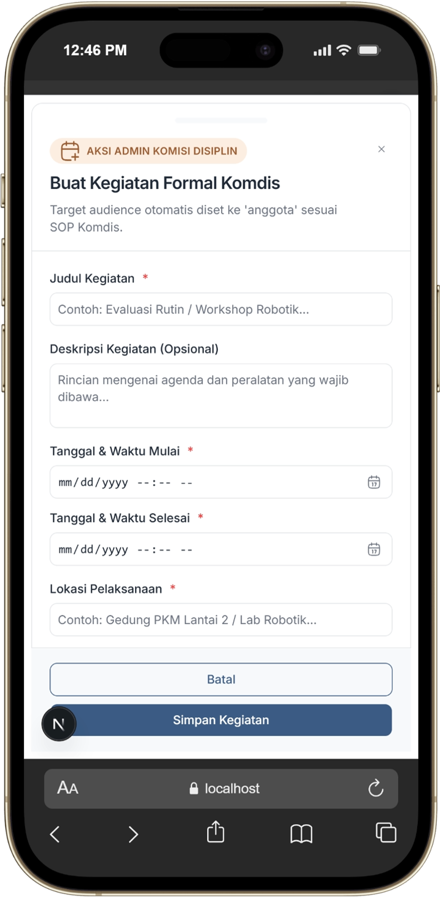

---

### 2.2 Mengedit / Memperbarui Kegiatan

1. Pada daftar kegiatan di `/kegiatan`, pilih kegiatan yang ingin diubah.
2. Klik ikon **Edit / Opsi** pada kartu kegiatan tersebut.
3. Ubah rincian kegiatan (waktu, lokasi, atau deskripsi).
4. Klik **"Perbarui Kegiatan"**.

<!-- PLACEHOLDER SCREENSHOT: Edit Kegiatan -->

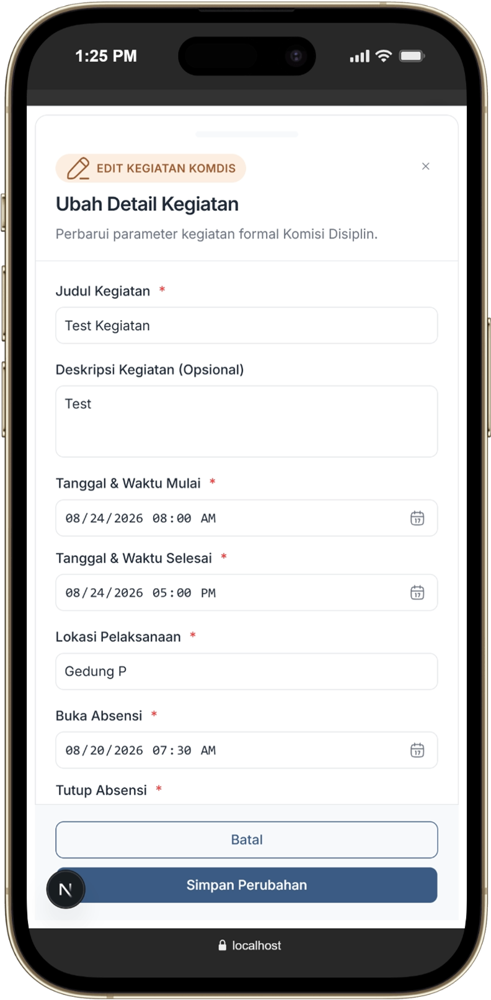

---

### 2.3 Soft Delete & Pemulihan Kegiatan (Tempat Sampah)

1. Jika kegiatan batal dilaksanakan, klik ikon **Hapus / Pindahkan ke Tempat Sampah**.
2. Kegiatan yang di-soft-delete akan berpindah ke tab **Tempat Sampah** (`/kegiatan/sampah`).
3. Untuk memulihkan kembali kegiatan tersebut, buka halaman `/kegiatan/sampah` lalu klik tombol **"Pulihkan"**.

<!-- PLACEHOLDER SCREENSHOT: Tempat Sampah & Restore Kegiatan -->

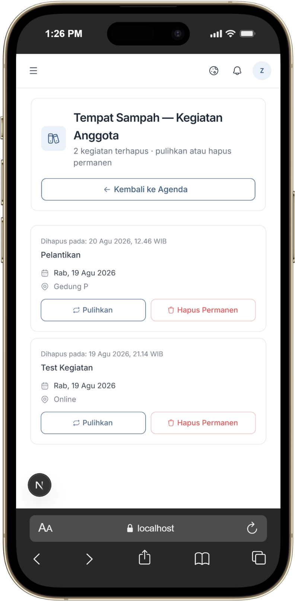

---

### 2.4 Menghapus Kegiatan Permanen

1. Masuk halaman **Tempat Sampah** (`/kegiatan/sampah`).
2. Pada kegiatan yang ingin dihapus total dari database, klik tombol **"Hapus Permanen"**.
3. Konfirmasi penghapusan.

> [!WARNING]
> Penghapusan secara permanen akan menghapus seluruh data kegiatan beserta seluruh riwayat presensi anggota yang terkait di dalamnya.

---

## 3. Alur Presensi Anggota & Admin

### 3.1 Presensi via Pemindaian QR Code (Scanner HP Admin)

1. Buka halaman Kegiatan (`/kegiatan`).
2. Klik tombol Presensi pada kegiatan yang dituju
3. Minta anggota menampilkan **QR Code Presensi** dari aplikasi HP mereka.
4. Arahkan kamera ke QR Code anggota.
5. Sistem akan mendekripsi token dinamis AES-256 dan memvalidasi secara otomatis:
   - **Hadir:** Jika scan dilakukan sebelum atau tepat pada masa toleransi keterlambatan.
   - **Telat:** Jika scan dilakukan setelah lewat toleransi keterlambatan.

<!-- PLACEHOLDER SCREENSHOT: Tampilan Scanner QR Code Admin Komdis -->

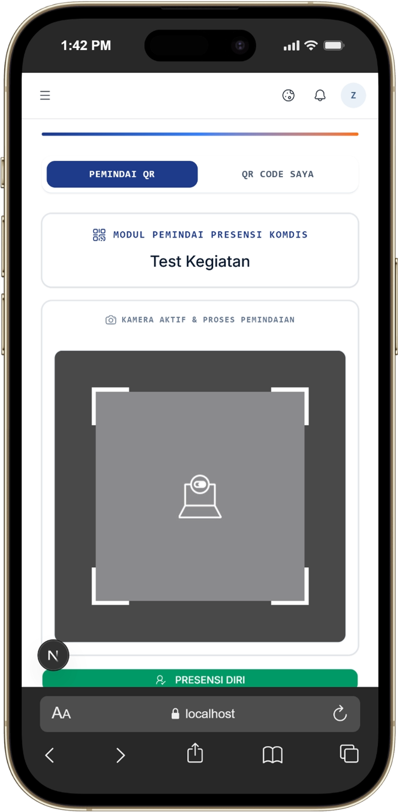

---

### 3.2 Presensi Mandiri Admin Komdis Bertugas

Sebagai petugas Komdis yang mengawasi presensi, Admin Komdis yang bertugas dapat mencatatkan presensinya sendiri secara instan:

1. Buka halaman Kegiatan (`/kegiatan`).
2. Klik tombol Presensi pada kegiatan yang dituju
3. Klik tombol **"Presensi Diri"**.
4. Status presensi Admin bertugas akan otomatis tercatat sebagai **HADIR**.

<!-- PLACEHOLDER SCREENSHOT: Tombol Presensi Mandiri Admin -->

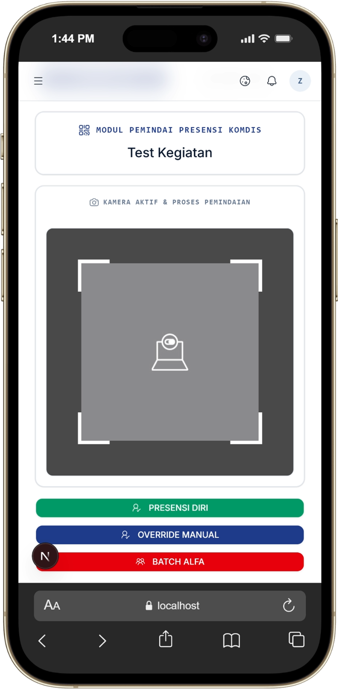

---

### 3.3 Presensi Manual / Edit Status Anggota Individu

Jika ada kendala HP anggota mati atau ada penyesuaian khusus oleh Komdis:

1. Buka halaman Presensi (`/presensi`).
2. Klik tab Rekap per Kegiatan.
3. Klik Detail Agenda pada kegiatan yang dituju.
4. Cari nama atau NIM anggota pada tabel.
5. Klik tombol **"Presensi Manual"** pada baris anggota tersebut.
6. Pada dialog yang muncul:
   - Pilih status: `Hadir`, `Telat`, `Izin`, `Sakit`, atau `Alfa`.
   - Tentukan **Poin Sanksi / Pelanggaran** (contoh: isi `5` jika telat parah).
   - Isi catatan/keterangan penyesuaian.
7. Klik **"Simpan Presensi"**.

<!-- PLACEHOLDER SCREENSHOT: Dialog Presensi Manual / Edit Status -->

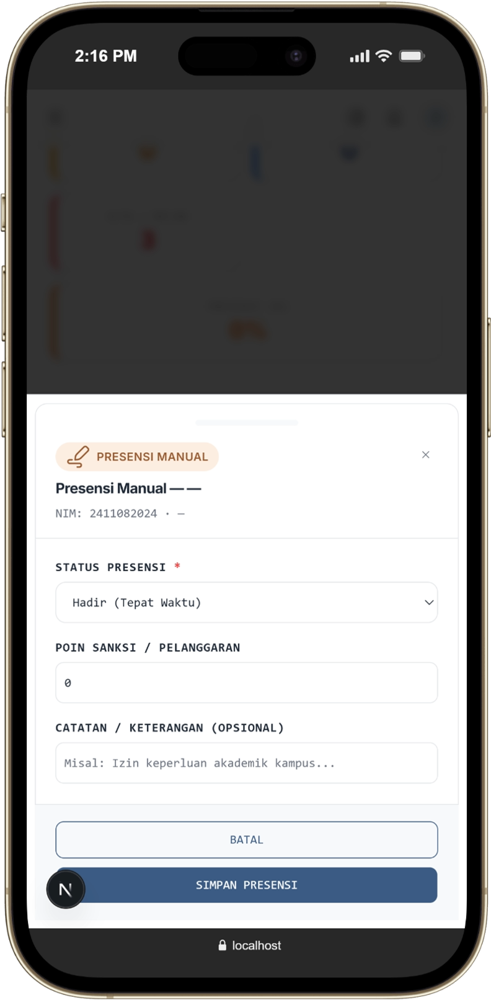

---

## 4. Pengelolaan & Verifikasi Perizinan (Izin / Sakit)

### 4.1 Meninjau Pengajuan Surat Izin / Sakit

1. Anggota yang tidak bisa hadir dapat mengajukan perizinan melampirkan file surat/bukti melalui akun mereka.
2. Masuk ke halaman **Perizinan** (`/perizinan`).
3. Anda akan melihat daftar pengajuan perizinan dengan status **Pending**.
4. Klik pada baris perizinan untuk melihat rincian alasan dan pratinjau **File Bukti / Surat**.

<!-- PLACEHOLDER SCREENSHOT: Halaman Verifikasi Perizinan -->

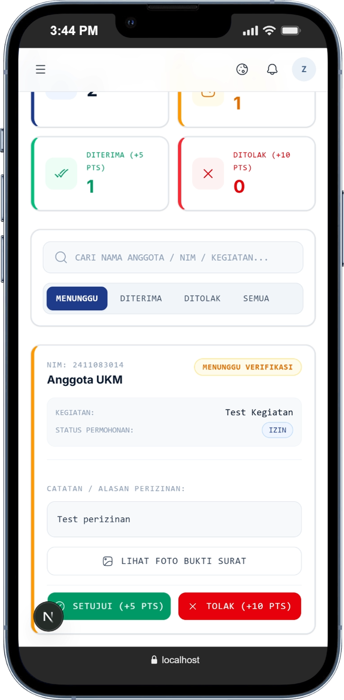

---

## 5. Penyelesaian Kegiatan (Alfa Massal)

### 5.1 Eksekusi Alfa Massal setelah Agenda Selesai

> [!IMPORTANT]
> **Langkah Wajib setelah Sesi Presensi Selesai:**
> Saat sesi kegiatan berakhir, anggota yang tidak hadir dan tidak mengajukan izin belum memiliki data presensi di tabel database. Admin Komdis **wajib menekan tombol Alfa Massal** untuk menutup agenda secara sempurna.

1. Buka halaman Presensi (`/presensi`).
2. Klik tab Rekap per Kegiatan.
3. Klik Detail Agenda pada kegiatan yang dituju.
4. Di bagian kanan atas header, klik tombol merah **"Alfa Massal"**.
5. Dialog konfirmasi akan muncul. Klik **"Tandai Alfa Massal"**.

<!-- PLACEHOLDER SCREENSHOT: Tombol dan Dialog Alfa Massal -->

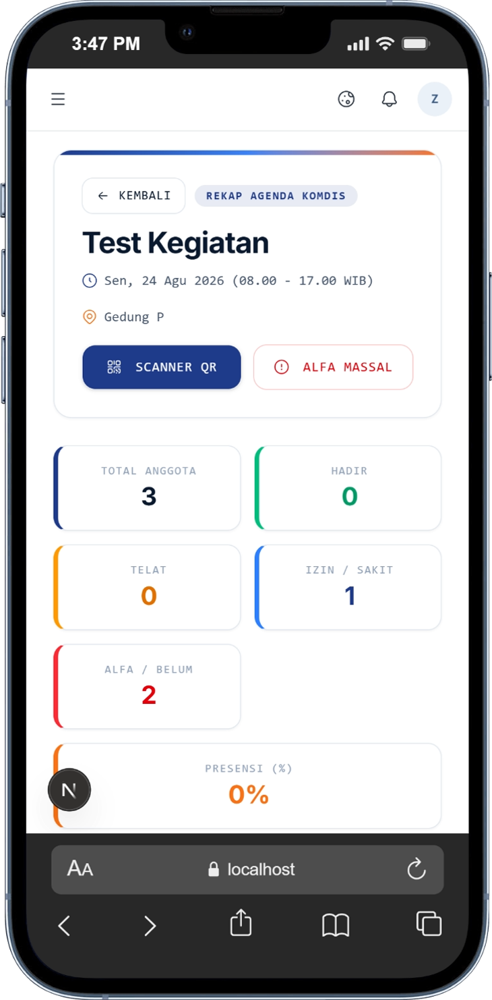

---

### 5.2 Logika Dispensasi Magang / PKL vs Alfa Tanpa Kabar

Saat tombol **Alfa Massal** dieksekusi, sistem secara cerdas akan memilah seluruh anggota unrecorded:

- **Anggota Status Magang / PKL (`is_on_internship = true`):**
  Otomatis diberi status **`IZIN`** dengan **0 PTS Sanksi** dan catatan _"Dispensasi Magang / PKL"_.
- **Anggota Aktif Tanpa Kabar:**
  Otomatis diberi status **`ALFA`** dengan **+15 PTS Sanksi** (SOP Pelanggaran Alfa Tanpa Kabar).

---

## 6. Direktori Kedisiplinan, Pemutihan Poin & Penerbitan SP

### 6.1 Pemantauan Rekapitulasi Poin Anggota

1. Masuk ke halaman **Kedisiplinan** (`/kedisiplinan`).
2. Halaman ini menampilkan tabel rekapitulasi poin akumulasi seluruh anggota aktif:
   - **Total Poin Presensi:** Jumlah poin sanksi dari ketidakhadiran/alfa kegiatan.
   - **Total Log Poin:** Hasil akumulasi dari pemutihan goro (poin negatif) atau poin pelanggaran manual.
   - **Net Points (Total Poin Sanksi Bersih):** Digunakan sebagai acuan ambang batas Surat Peringatan (SP).
   - **Status SP Aktif:** Indikator apakah anggota sedang memegang SP1, SP2, atau SP3.

<!-- PLACEHOLDER SCREENSHOT: Tabel Direktori Kedisiplinan -->

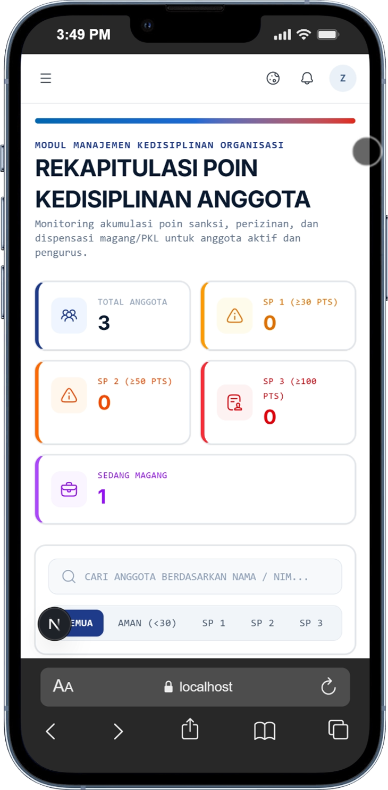

### 6.2 Pencatatan Pemutihan Poin (Goro)

Jika anggota yang memiliki poin sanksi telah melaksanakan tugas pemutihan (misalnya Gotong Royong / Goro Workshop):

1. Pada halaman Kedisiplinan (`/kedisiplinan`) klik tombol **"Detail"** anggota yang bersangkutan.
2. Klik tombol **"Pemutihan Goro"**.
3. Isi formulir:
   - **Kategori Pemutihan:** Pilih jenis Goro (misal: _Goro SP1 / Pemutihan Komdis_).
   - **Jumlah Poin Pengurangan:** Masukkan nilai negatif (contoh: `-10` PTS atau `-15` PTS).
   - **Keterangan:** Detail tugas yang telah diselesaikan.
4. Klik **"Simpan Pemutihan"**. _Net Points_ anggota akan otomatis berkurang.

<!-- PLACEHOLDER SCREENSHOT: Form Input Pemutihan Poin Goro -->

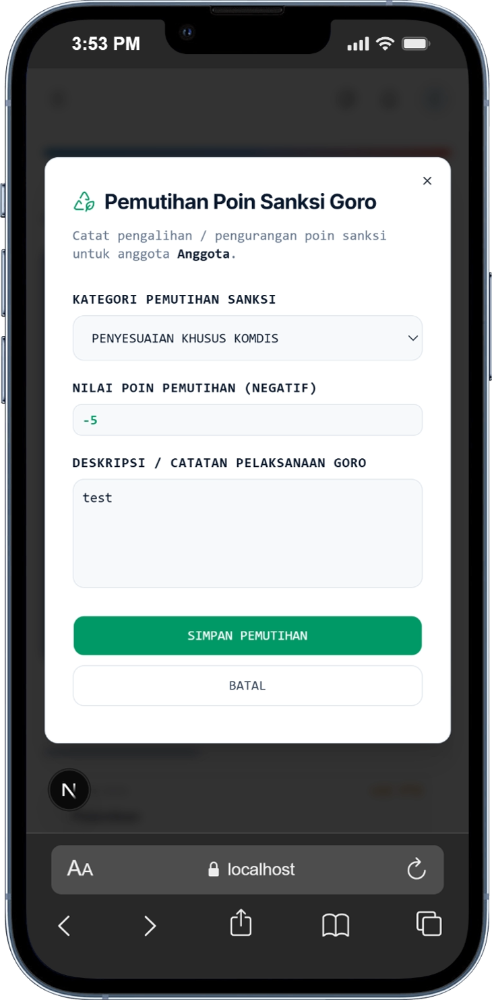

---

### 6.3 Penerbitan Surat Peringatan (SP1, SP2, SP3)

1. Pada halaman Kedisiplinan (`/kedisiplinan`) klik tombol **"Detail"** anggota yang bersangkutan.
1. Pada halaman detail kedisiplinan anggota (`/kedisiplinan/[profileId]`), tinjau akumulasi _Net Points_.
1. Jika poin sanksi telah mencapai ambang batas SOP Komdis:
   - **SP 1:** Batas poin sanksi awal.
   - **SP 2:** Batas poin sanksi tingkat sedang.
   - **SP 3:** Batas poin sanksi tingkat berat / skorsing.
1. Klik tombol **"Terbitkan SP"**.
1. Pilih **Tingkat SP** (`SP 1`, `SP 2`, atau `SP 3`), isi catatan pelanggaran/tindakan komdis.
1. Klik **"Terbitkan Surat Peringatan"**. Status SP aktif akan tercatat secara audit-trail di sistem.

<!-- PLACEHOLDER SCREENSHOT: Form Penerbitan Surat Peringatan (SP) -->

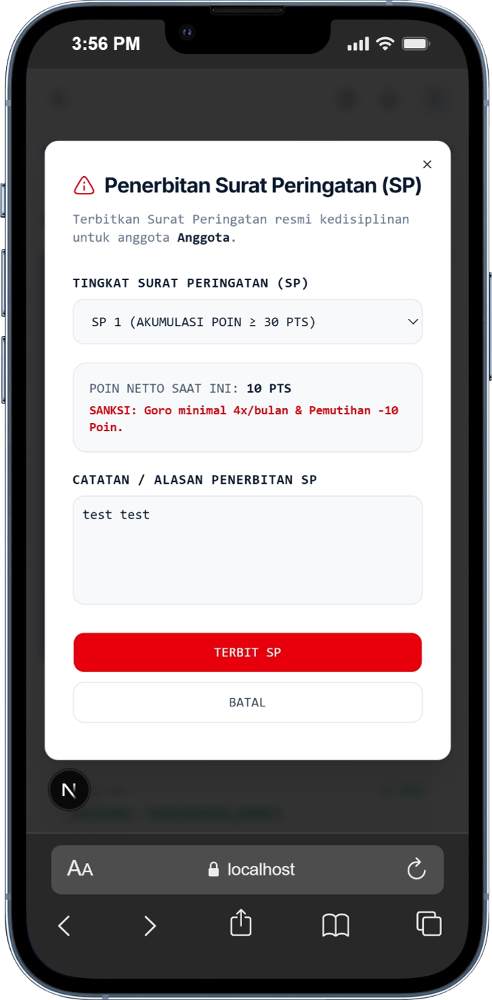

---

_Dokumen Panduan Operasional Kedisiplinan UKM Robotik PNP — versi 1.0_
